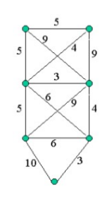

# Problema da rede de computadores
- Trabalho final da disciplina de Teoria de Grafos

Primeiramente será necessário dar uma identificação para cada computador, dessa forma, poderemos implementar um algoritmo para encontrar o menor caminho.

Com o menor caminho poderá ser possível determinar as ligações inúteis.

Dessa forma, já que se trata de um problema que possui poucos vértices, poderá ser aplicado o **Algoritmo de Dijkstra,** mesmo sendo um algoritmo guloso.

**Algoritmo**:

**1-** Irá ser definido as arestas com os pesos.

**2-** Irá ser definido, de forma separadas, os vértices (computadores).

**3-** Será instanciado a classe que irá executar o algoritmo passando as arestas, vértices e o vértice para começar o algoritmo.

Após a realização do algoritmo, será armazenado o caminho a ser seguido com os seguintes valores:

O qual mostra ComputadorId (Vértice) e Prev (Computador Anterior) e os seus respectivos valores nas arestas. Para ficar uma melhor visualização foi feita uma função para mostrar de uma forma mais simples:

